# Learning Jenkins Pipeline

This is just a basic guide on how to simulate how to set-up a Jenkins Pipeline

# Sample Pipeline Script

1. Spin up Jenkins Server

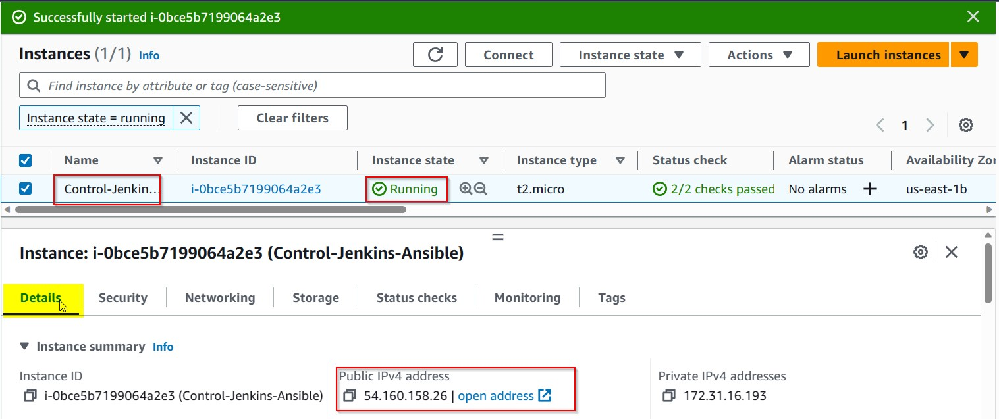

2. Launch it on the browser with your credentials

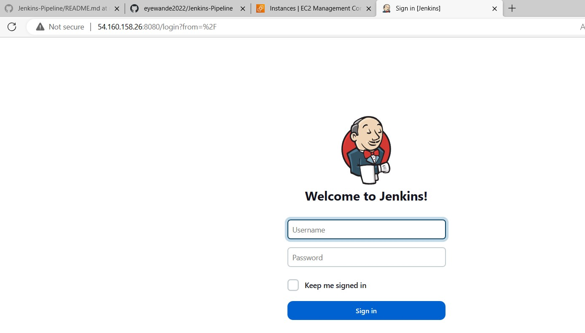

3. On the Dashboard page Click a new item

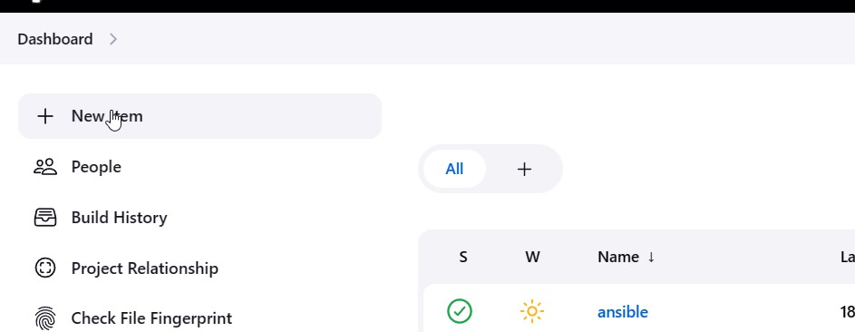

4. Enter an item name and then Select Pipeline

5. Click ok

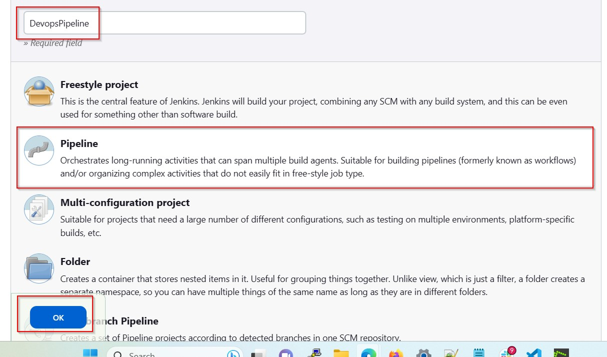

6. Navigate and Click the Pipeline and Select Pipeline Script

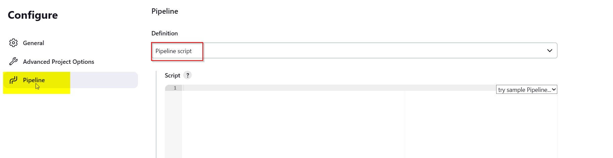

7. Select "Hello World" on the drowndown as shown below

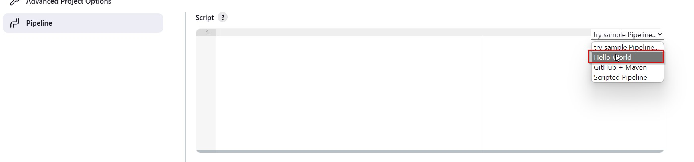

8. "Hello World" Script is generated .Click apply and save the changes

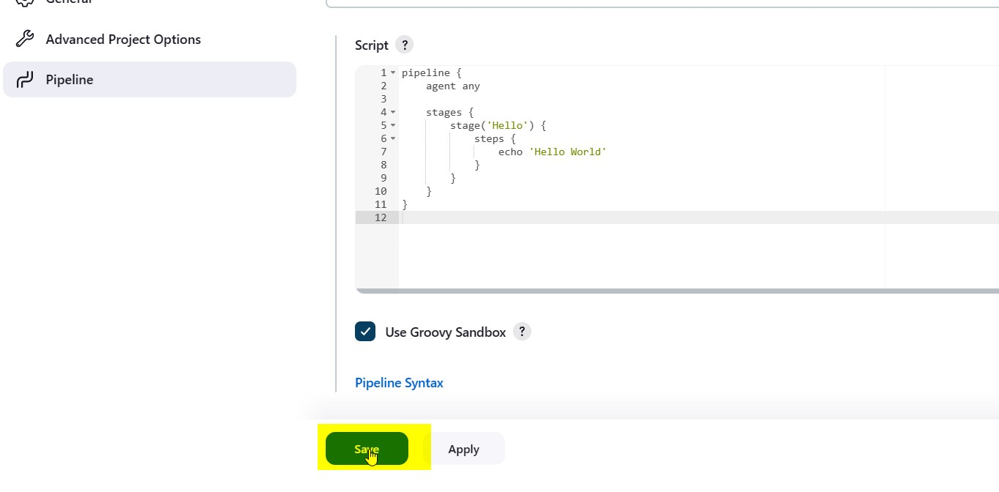

9. Select Build Now from the new pipeline to test that the configuration works perfectly as seen below

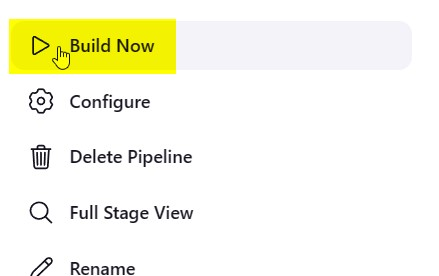

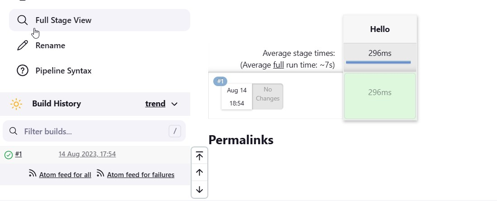

#### Build 1 is successful

10. The next step would be for us to create our own pipeline script by simply repeating the previous steps

11. In the pipeline script sectipn paste the code below

pipeline {
agent any

    stages {
        stage('Hello') {
            steps {
                echo 'Hello World'
            }
        }
        stage('Practice'){
            steps{

                echo 'This is my first practice to get an outcome on this scripting'
                echo 'You are the answer '
                  echo 'To human problem'
                   echo 'Position yourself '
            }}

    		stage('Devops Projects'){
            steps{

                echo 'Configuration Management'
                echo 'Monitoring Performance and Logging Management  '
                  echo 'Tracking and Traceability'
                   echo 'Reliability Engineering'
            }}

            stage('Change Directory'){
            steps{

                dir('/var') {
    // some block   }}}}}

12. Click apply and save the changes

13. Click the build Number 1

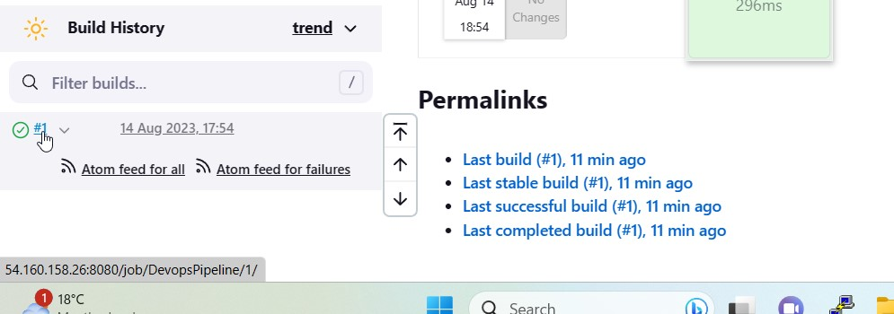

14. Click Replay to modify the codes in the pipeline script section.
    You can view the old script and new script that it was modified into below

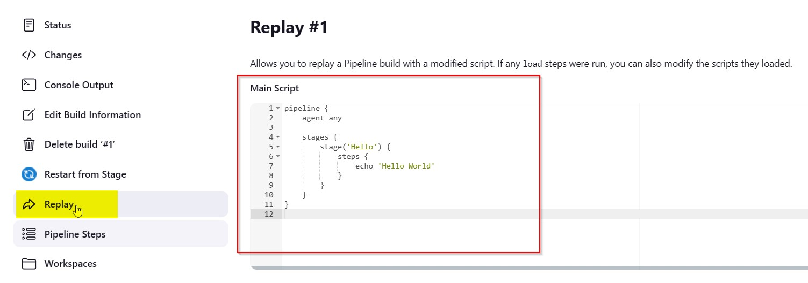

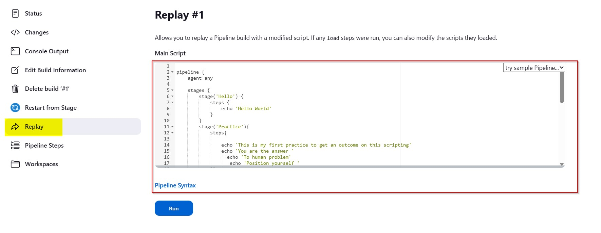

16. Click the Run Button

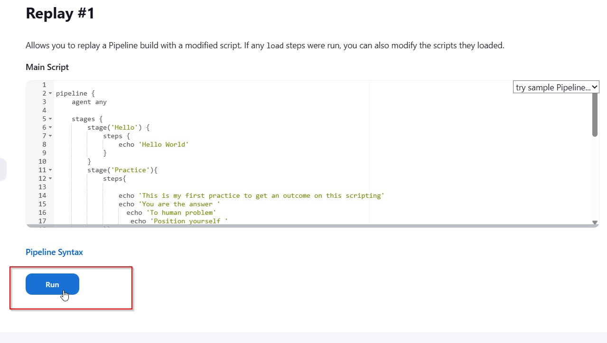

#### Build 2 and Build 3 can be seen successful with the pipeline scripts modified to the one that was created

